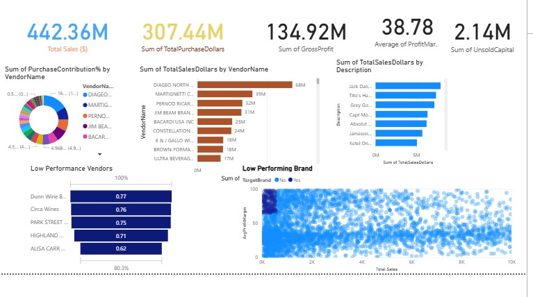

# My Power BI Dashboard Portfolio

This repository is a collection of Power BI dashboards I.ve developed. It tracks my journey in using Power BI, from fundamental reports to moreb advanced interactive analysis, all aimed at turning data into clear, actionable insights.

# Featured Dashboards

Explore the dashboards below. Each has its own dedicated README with more detail on the nuild process and specific features.

## Data Jobs Dashboard(v1- Comprehensive Exploration)

**Key Power BI Skills Utilized:**
* Dashboard Layout & Design
* Power Query (ETL & Data Shaping)
* Basic Data Modeling (Table Relationship)
* Implicit Measures & Standard Aggregations
* Core Charts (Bar, Line , Area, Column)
* Map visualisation for Geospatial Data
* KPI Cards & Detailed Data Tables
* Interactive Slicers for Filtering
* Buttons & Bookmarks for Page Navigation
* Drill-Through Functionality

[**View Full project in detail(README)**](Data_jobs/README.md)