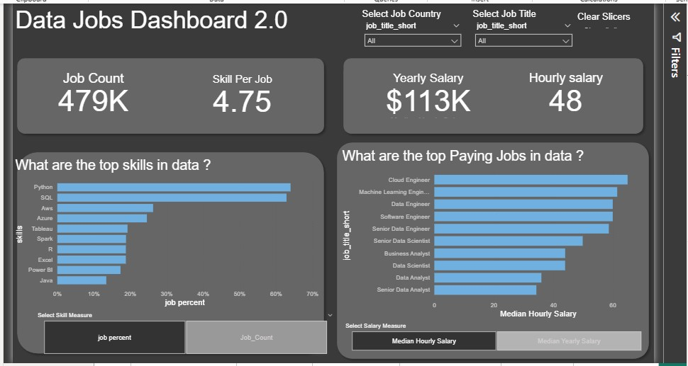

# My Power BI Dashboard Portfolio

This repository is a collection of Power BI dashboards I.ve developed. It tracks my journey in using Power BI, from fundamental reports to moreb advanced interactive analysis, all aimed at turning data into clear, actionable insights.

# Featured Dashboards

Explore the dashboards below. Each has its own dedicated README with more detail on the nuild process and specific features.

## Data Jobs Dashboard(v1- Comprehensive Exploration)

**Key Power BI Skills Utilized:**
* Dashboard Layout & Design
* Power Query (ETL & Data Shaping)
* Basic Data Modeling (Table Relationship)
* Implicit Measures & Standard Aggregations
* Core Charts (Bar, Line , Area, Column)
* Map visualisation for Geospatial Data
* KPI Cards & Detailed Data Tables
* Interactive Slicers for Filtering
* Buttons & Bookmarks for Page Navigation
* Drill-Through Functionality

[**View Full project in detail(README)**](Data_jobs/README.md)

## Data Jobs Dashboards 2.0 (v2 -Single-Page Focus)

**Key Power BI Skills Utilized (demonnstrating progression):**
* Advanced Dashboard Design (Single-Page UX & Optimization)
* Complex Power Query Transformations
* Star Schema Data Modeling Principles
* Explicit DAX Measures (e.g, `CALCULATE`, context modifiers)
* Dynamic Visualisation (driven by Parametrs/Slicers)
* Field & Numeric Parameter Implementaion for "What-IF" Analysis
* Enhanced Geospatial Insights
* Advanced Card Visualizations
* Optimized slicers & Advanced Cross-Filtering Techniques
* Report Performance Considerations
* Report Performance Considerations

[**View Full Project 2 Details (README)**](Data_jobs_v2\README.md)

## About This Portfolio

Each dashboard linked above its own detailed `README.md`
file within its respective project folder. These offer deeper insights into the project objectives, data sources, specific POwer BI techniques employed, and a closer look at the dashboard build.
